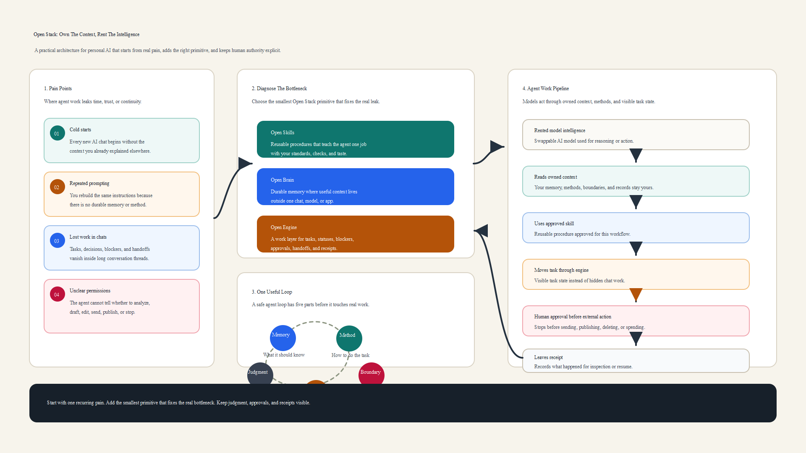

# Open Stack Tutorial

This repository contains a visual tutorial and source-grounded notes explaining Open Stack: how to diagnose agent workflow pain, choose the right primitive, and keep memory, methods, approvals, and receipts under the user's control.

## Source

- YouTube video: [AI agents can now build most of your own AI memory stack for you](https://www.youtube.com/watch?v=HgAQOkG_v8c)

## Files

- `open_stack_infographic_explained.png` - visual overview of the Open Stack workflow.
- `open_stack_memory_intent_source_synthesis_report.md` - synthesis of the memory, intent, and ownership argument.
- `open_stack_field_guide_prompt_architecture_report.md` - explanation of the Open Stack guide workflow and prompt architecture.
